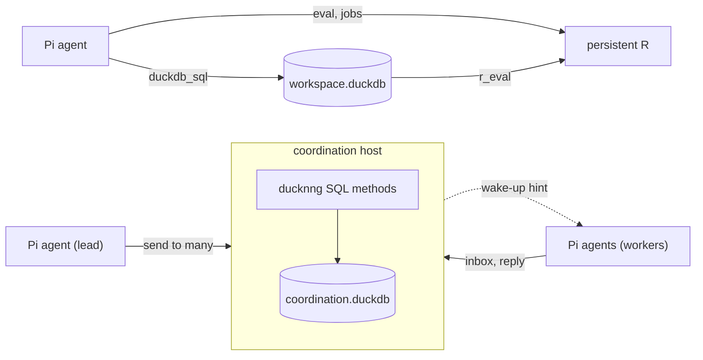

<!-- README.md is generated from README.qmd with `make readme`. Edit README.qmd. -->

# pi-ducknng

<a href="https://lifecycle.r-lib.org/articles/stages.html#experimental"></a>
<a href="https://github.com/sounkou-bioinfo/pi-ducknng/actions/workflows/pkgdown.yaml"></a>

pi-ducknng lets [Pi](https://github.com/earendil-works/pi) agents do
data work that lasts. An agent keeps its results in a DuckDB database
that outlives the conversation, computes in a persistent R session, and
hands work to other agents through a durable mailbox. All three run over
[ducknng](https://github.com/RGenomicsETL/ducknng), DuckDB’s NNG
extension.

The package is experimental and has no users outside itself. Its tools,
SQL schema and wire contract change without deprecation cycles or
migrations, in favour of a clearer model.

## Install

``` sh
pi install git:github.com/sounkou-bioinfo/pi-ducknng
```

The first call downloads the pinned ducknng release for Linux or macOS
and checks its SHA-256 against [`DEPENDENCIES`](DEPENDENCIES). In a
source checkout, `make ducknng-extension` builds it instead, and
`DUCKNNG_EXTENSION_PATH` names any other build. R work needs `Rscript`
on `PATH` and the packages under `Imports` in
[`DESCRIPTION`](DESCRIPTION).

## Answer a question and keep the result

Give an agent a question about a dataset. It computes in R and saves
what it found as a table:

**Task**

> Which grouping of `datasets::mtcars`, by `cyl`, `gear` or `am`,
> separates mean `mpg` the most? Compute the group means in R and keep
> them in the SQL workspace as a table `mpg_groups` with columns
> `grouping`, `level` and `mean_mpg`. Answer in two sentences.

**The agent answered**

> Using the range of group means, `cyl` separates mean `mpg` most: 11.56
> mpg, versus 8.43 for `gear` and 7.24 for `am`. Computed all eight
> group means in R and saved them in SQL table `mpg_groups` with columns
> `grouping`, `level`, and `mean_mpg`.

The agent has exited, and its table has not. Any DuckDB client can read
the workspace file, `.pi/ducknng/workspace.duckdb` in the project:

``` r
workspace_sql("
  SELECT grouping, count(*) AS levels,
         round(max(mean_mpg) - min(mean_mpg), 2) AS spread
  FROM mpg_groups GROUP BY grouping ORDER BY spread DESC
")
```

      grouping levels spread
    1      cyl      3  11.56
    2     gear      3   8.43
    3       am      2   7.24

> README_WORKSPACE_VERIFIED: the agent’s table has three groupings and
> eight group means

The agent works through these tools:

- `duckdb_sql` runs SQL in the project’s workspace with ducknng loaded
  and returns the first rows. Tables persist across sessions, so results
  that matter are kept there rather than in the conversation.
- `persistent_r_start` starts an R process that keeps its objects
  between calls. Inside SQL, `FROM r_eval('<R code>')` returns an R
  value as rows, so `CREATE TABLE t AS FROM r_eval(...)` saves it.
- `ducknng_describe` and `ducknng_call` reach every method the R
  endpoint declares: `eval`; `submit`, `job`, `result` and `interrupt`
  to follow a long computation as it prints and stop it; `scopes` and
  `reset` to keep separate analyses in named environments.

Aborting a Pi tool call interrupts the R job it was waiting on, and the
R session keeps its state. When `PI_DUCKNNG_R_LOCATOR` names a file, Pi
writes the R session’s URL there so another client can attach to it.

## Split a study across agents

Agents started independently of each other can pass work through a
coordination endpoint: a DuckDB database whose methods are [SQL
files](coordination/methods) served by ducknng. Start it outside any Pi
session:

``` bash
node tools/pi-coordination-endpoint.ts \
  "$STATE/coordination.url" "$STATE/coordination.duckdb" > "$STATE/endpoint.log" 2>&1 &
echo $! > "$STATE/endpoint.pid"
until [ -s "$STATE/coordination.url" ]; do sleep 0.1; done
```

A Pi session joins when `PI_DUCKNNG_COORDINATION_URL`,
`PI_DUCKNNG_COORDINATION_PROJECT` and `PI_DUCKNNG_AGENT_ID` are set, and
gains tools to send, receive, list agents, and reserve files. A lead
hands out a question before any worker exists:

**Task**

> You lead a small study of `datasets::mtcars`. Three agents, `w-cyl`,
> `w-gear` and `w-am`, will each study the grouping their ID names; none
> has started yet. Send a single message addressed to all three at once,
> asking how far apart the mean `mpg` of their groups are and to reply
> to it. Then stop.

**Agent `lead` answered**

> Sent one message to `w-cyl`, `w-gear`, and `w-am`, requesting group
> mean `mpg`, pairwise differences, and replies to that message.

The three workers start together, each in its own directory, with the
same task:

``` bash
cat tools/readme/worker-prompt.md
```

    You are a worker in a small study, and your agent ID names the grouping of `datasets::mtcars` you study: `w-cyl` groups by `cyl`, `w-gear` by `gear`, and `w-am` by `am`. Wait up to 20 seconds for the lead's question in your coordination inbox, answer it with R, and reply to that message in one line such as `cyl: spread 11.56 (4=26.66, 6=19.74, 8=15.10)`.

``` bash
for worker in w-cyl w-gear w-am; do
  mkdir -p "$STATE/$worker"
  (cd "$STATE/$worker" && PI_DUCKNNG_AGENT_ID="$worker" timeout 900 pi \
    --provider openai-codex --model gpt-6-astra --thinking medium \
    --no-extensions -e "$ROOT/extensions/pi-ducknng/index.ts" --no-session \
    -p "$(cat "$ROOT/tools/readme/worker-prompt.md")" > "$STATE/$worker.out" 2>&1) &
done
wait
```

The endpoint, not the agents, confirms that three replies came back to
the same message. This check holds the replies for one second without
acknowledging them, so the lead still receives them:

``` r
url <- guide_url()
peek <- rpc_call(url, "register", list(
  project_id = "readme", agent_id = "lead",
  instance_id = "verifier", operation_key = "verify"
))
replies <- rpc_call(url, "receive", list(
  registration_id = peek$registration_id, limit = 8, visibility_timeout_ms = 1000
))$messages
threads <- unique(vapply(replies, function(m) m$in_reply_to %||% "", ""))
stopifnot(length(replies) == 3L, length(threads) == 1L, nzchar(threads))
invisible(rpc_call(url, "unregister", list(registration_id = peek$registration_id)))
cat("COORDINATION_FANIN_VERIFIED",
  vapply(replies, function(m) paste0(m$sender_agent_id, ": ", m$content), ""),
  sep = "\n")
```

    COORDINATION_FANIN_VERIFIED
    w-cyl: cyl: spread 11.56 mpg (4=26.66, 6=19.74, 8=15.10); pairwise mean differences: 4−6=6.92, 4−8=11.56, 6−8=4.64 mpg.
    w-gear: gear: spread 8.43 mpg (3=16.11, 4=24.53, 5=21.38); pairwise mean differences: 4−3=8.43, 5−3=5.27, 4−5=3.15 mpg.
    w-am: am: spread 7.24 mpg (0=17.15, 1=24.39); pairwise difference 1-0=7.24 mpg

The lead gathers the answers:

**Task**

> Collect the replies to your study question from your coordination
> inbox, waiting up to 20 seconds, and say in two sentences which
> grouping of `datasets::mtcars` separates mean `mpg` the most.

**Agent `lead` answered**

> Among the studied groupings of `datasets::mtcars`, `cyl` separates
> mean `mpg` the most: 4-cylinder cars average 26.66 versus 15.10 for
> 8-cylinder cars, a spread of 11.56 mpg. This exceeds the spreads for
> `gear` (8.43 mpg) and `am` (7.24 mpg).

## How it fits together



- The workspace belongs to the project. Each Pi session opens it on
  first use, so one session at a time writes to it.
- The R process belongs to the Pi session that started it and exits with
  it. Its objects are scratch; tables are what lasts.
- The coordination host is a Node process that loads ducknng into DuckDB
  and serves the SQL methods. It owns its database file, and agents
  reach it only through those methods. `send` stores one copy per
  recipient before it replies, then publishes an opaque wake-up hint per
  mailbox.
- Pi owns the conversation. The adapter keeps the registration out of
  model context and frames every delivered message with its sender, so
  another agent’s text never reads as the user’s.

## Guarantees

- **At least once.** A crash between delivery and acknowledgement
  redelivers the same message ID. Work done in response is not exactly
  once.
- **Stored before acknowledged.** Mail survives disconnected sessions
  and endpoint restarts. Mail nobody receives becomes a dead letter
  after 7 days.
- **Leases guard Pi’s file tools.** While another session holds a path,
  Pi’s `edit` and `write` refuse to touch it. Writes made through `bash`
  are not guarded.
- **Hints are only hints.** A wake-up carries no mail, and correctness
  never depends on it arriving. Clients without an NNG binding can
  follow the same wake-ups as Server-Sent Events when the host is
  started with `--sse`.

## Across hosts

Over `ipc://`, filesystem permissions decide who may connect. To serve
agents on other hosts, run the endpoint on mutual TLS with a grants file
that says which certificate may act as which agent. Each party’s
certificate and key sit in one PEM file; a throwaway CA signs them here.

``` bash
cat > "$STATE/grants.json" <<'JSON'
[{"peer_identity": "tls:cn:reviewer", "project_id": "readme", "agent_id": "reviewer"}]
JSON
node tools/pi-coordination-endpoint.ts "$STATE/mtls.url" "$STATE/mtls.duckdb" \
  tls+tcp://127.0.0.1:0 \
  --tls-cert-key "$STATE/tls/server.pem" --tls-ca "$STATE/tls/ca.pem" \
  --grants "$STATE/grants.json" --events wss://127.0.0.1:0/events \
  > "$STATE/mtls.log" 2>&1 &
echo $! > "$STATE/mtls.pid"
until [ -s "$STATE/mtls.url" ]; do sleep 0.1; done
```

A Pi session names its CA and its own certificate in
`PI_DUCKNNG_TLS_CA_FILE` and `PI_DUCKNNG_TLS_CERT_KEY_FILE`, and so does
`tools/coordination-call.ts`. The granted certificate registers and
learns its `wss://` hint listener; the other is refused before any state
changes:

``` bash
register_as() {
  PI_DUCKNNG_TLS_CA_FILE="$STATE/tls/ca.pem" \
  PI_DUCKNNG_TLS_CERT_KEY_FILE="$STATE/tls/$1.pem" \
    node tools/coordination-call.ts "$(cat "$STATE/mtls.url")" register \
    '{"project_id": "readme", "agent_id": "reviewer", "instance_id": "'"$1"'",
      "operation_key": "demo"}' agent_id,events.url 2>&1
}
register_as reviewer
register_as intruder || true
```

    {"agent_id":"reviewer","events.url":"wss://127.0.0.1:39801/events"}
    unauthorized: tls:cn:intruder has no grant for readme/reviewer

A registration ID is useless to any certificate but the one that created
it.

## Embedding

A host process that owns a `pi-agent-core` `AgentHarness` can attach a
lane to a mailbox with `attachCoordinationLane` from
[`extensions/pi-ducknng/harness.ts`](extensions/pi-ducknng/harness.ts).
Each message is committed to the lane before it is acknowledged, and a
redelivered message is matched to its existing lane entry by message ID.
[`test/coordination-harness.test.js`](test/coordination-harness.test.js)
runs it against a real harness.

## Guides

Each guide gives live agents real tasks and then checks what they left
behind. Its outputs are recorded when the guide is built.

**Data work**

- [Answer a question in R and keep the result in
  SQL](https://sounkou-bioinfo.github.io/pi-ducknng/articles/agent-product-path.html)
- [Keep two analyses apart in named R
  scopes](https://sounkou-bioinfo.github.io/pi-ducknng/articles/agent-active-binding.html)
- [Follow, interrupt and share a long R
  computation](https://sounkou-bioinfo.github.io/pi-ducknng/articles/r-jobs.html)

**Working together**

- [Hand work to an agent that is not running
  yet](https://sounkou-bioinfo.github.io/pi-ducknng/articles/coordination-mailbox.html)
- [Fan a question out and gather the
  answers](https://sounkou-bioinfo.github.io/pi-ducknng/articles/coordination-fanout.html)
- [Keep agents from editing the same
  files](https://sounkou-bioinfo.github.io/pi-ducknng/articles/coordination-reservations.html)
- [Recover mail after crashes and
  restarts](https://sounkou-bioinfo.github.io/pi-ducknng/articles/coordination-durability.html)
- [Follow a mailbox from any HTTP
  client](https://sounkou-bioinfo.github.io/pi-ducknng/articles/coordination-sse.html)

**Deployment**

- [Serve agents on other hosts with mutual
  TLS](https://sounkou-bioinfo.github.io/pi-ducknng/articles/coordination-mtls.html)
- [Deliver mail into an AgentHarness
  lane](https://sounkou-bioinfo.github.io/pi-ducknng/articles/coordination-harness.html)

[`THESIS.md`](THESIS.md) lists the contracts, owners and invariants, and
the tests that prove them.

## Pinned runtime

| Component                         | Version              |
|:----------------------------------|:---------------------|
| DuckDB                            | 1.5.4                |
| `@duckdb/node-api`                | 1.5.4-r.1            |
| ducknng                           | `v0.1.3-duckdb1.5.4` |
| `@earendil-works/pi-coding-agent` | 0.86.1               |
| `@earendil-works/pi-agent-core`   | 0.86.1               |

[`DEPENDENCIES`](DEPENDENCIES) is the version authority and records the
exact source commits.
