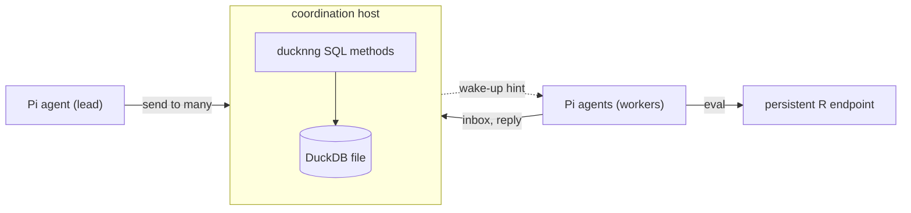

<!-- README.md is generated from README.qmd with `make readme`. Edit README.qmd. -->

# pi-ducknng

<a href="https://lifecycle.r-lib.org/articles/stages.html#experimental"></a>
<a href="https://github.com/sounkou-bioinfo/pi-ducknng/actions/workflows/pkgdown.yaml"></a>

pi-ducknng gives [Pi](https://github.com/earendil-works/pi) agents two
services over [ducknng](https://github.com/RGenomicsETL/ducknng): a
persistent R session to compute in, and a durable mailbox that lets
independently started agents hand each other work, fan one question out
to many of them, and gather the answers.

The package is experimental and has no users outside itself. Its tools,
SQL schema and wire contract change without deprecation cycles or
migrations, in favour of a clearer model.

## Install

``` sh
pi install git:github.com/sounkou-bioinfo/pi-ducknng
```

The first call builds the pinned ducknng source, which needs Git, Make,
CMake, Python and a C/C++ toolchain. The persistent R endpoint needs the
packages under `Imports` in [`DESCRIPTION`](DESCRIPTION).

## Persistent R

An agent starts the R endpoint, reads its manifest, and keeps working in
the same R process across calls:

``` sh
'pi' --provider 'openai-codex' --model 'gpt-6-astra' --no-extensions --thinking 'medium' -e './extensions/pi-ducknng/index.ts' --no-session -p \
  "$(printf %s \
    'Using the package tools, start the R adapter and follow ' \
    'its ducknng manifest. In one eval call, create and ' \
    'return `mpg_by_cyl <- aggregate(mpg ~ cyl, data = ' \
    'datasets::mtcars, FUN = mean)`. In a separate eval call, ' \
    'use the persisted `mpg_by_cyl` to return ' \
    '`transform(mpg_by_cyl, delta_from_4cyl = mpg - mpg[cyl ' \
    '== 4])`. Close the endpoint. Report the manifested ' \
    'methods and decoded rows, beginning with ' \
    '`AGENT_DUCKNNG_MANIFEST_CALL_OK` only when both calls ' \
    'used the same endpoint process and succeeded.')"
```

> AGENT_DUCKNNG_MANIFEST_CALL_OK
>
> Manifested methods: `eval` (JSON → Arrow, persistent R process),
> `close` (JSON → JSON).
>
> Both eval calls succeeded in endpoint process **749848**. Endpoint
> closed successfully.
>
> First call decoded rows:
>
> | cyl |                mpg |
> |----:|-------------------:|
> |   4 | 26.663636363636364 |
> |   6 | 19.742857142857144 |
> |   8 |               15.1 |
>
> Second call decoded rows, using persisted `mpg_by_cyl`:
>
> | cyl |                mpg |     delta_from_4cyl |
> |----:|-------------------:|--------------------:|
> |   4 | 26.663636363636364 |                   0 |
> |   6 | 19.742857142857144 |   -6.92077922077922 |
> |   8 |               15.1 | -11.563636363636364 |

The R environment lives until `close` or until the Pi process that
started it exits. Results come back as Arrow IPC.

## Parallel research

The coordination endpoint is a DuckDB database whose methods are [SQL
files](coordination/methods) served by ducknng. Start it outside any Pi
session, in a private directory:

``` bash
install -d -m 700 "$STATE"
node tools/pi-coordination-endpoint.ts \
  "$STATE/coordination.url" "$STATE/coordination.duckdb" > "$STATE/endpoint.log" 2>&1 &
echo $! > "$STATE/endpoint.pid"
until [ -s "$STATE/coordination.url" ]; do sleep 0.1; done
echo "coordination endpoint ready"
```

    coordination endpoint ready

A Pi session joins when `PI_DUCKNNG_COORDINATION_URL`,
`PI_DUCKNNG_COORDINATION_PROJECT` and `PI_DUCKNNG_AGENT_ID` are set. It
then has `coordination_send`, `coordination_inbox`,
`coordination_agents`, `coordination_reserve` and
`coordination_release`. A lead agent fans one question out to three
workers that have not started yet:

``` sh
'pi' --provider 'openai-codex' --model 'gpt-6-astra' --no-extensions --thinking 'medium' -e './extensions/pi-ducknng/index.ts' --no-session -p \
  "$(printf %s \
    'You are agent `lead`. Make one coordination_send call to ' \
    'recipients `w-cyl`, `w-gear`, and `w-am` with this ' \
    'content: `Which grouping of datasets::mtcars separates ' \
    'mean mpg the most? Your agent ID names your grouping. ' \
    'Reply in_reply_to this broadcast with the spread of your ' \
    'group means.` Report the broadcast ID and the ' \
    'recipients, beginning with `AGENT_FANOUT_SENT` only when ' \
    'the send was stored.')"
```

> AGENT_FANOUT_SENT broadcast_id=2a24c3b6-f31d-404f-82bb-94dc5c44a951
> recipients=w-cyl,w-gear,w-am

Each worker is its own `pi -p` process with this prompt:

``` bash
cat tools/readme/worker-prompt.md
```

    You are one worker in a parallel study. Call coordination_inbox with wait_ms 20000 and read the lead's broadcast. Your agent ID names your grouping: w-cyl groups by cyl, w-gear by gear, and w-am by am. Start the persistent R adapter, follow its ducknng manifest, compute mean mpg of datasets::mtcars for each level of your grouping, and close the adapter. Reply to the sender with coordination_send, setting in_reply_to to the broadcast ID, in one line of the form `<grouping>: spread <max minus min group mean, 2 decimals> (<level>=<mean>, ...)`. Begin your final answer with `AGENT_WORKER_REPLIED <your agent ID>` only when you received the broadcast and your reply was stored, followed by the reply line.

The three run at the same time. Each pulls its copy, computes in its own
persistent R session, and replies:

``` bash
for worker in w-cyl w-gear w-am; do
  PI_DUCKNNG_AGENT_ID="$worker" timeout 900 pi --provider openai-codex \
    --model gpt-6-astra --thinking medium --no-extensions \
    -e ./extensions/pi-ducknng/index.ts --no-session \
    -p "$(cat tools/readme/worker-prompt.md)" > "$STATE/$worker.out" 2>&1 &
done
wait
grep -h -A1 '^AGENT_WORKER_REPLIED' "$STATE"/w-*.out
```

    AGENT_WORKER_REPLIED w-am
    am: spread 7.24 (0=17.15, 1=24.39)
    --
    AGENT_WORKER_REPLIED w-cyl
    cyl: spread 11.56 (4=26.66, 6=19.74, 8=15.10)
    --
    AGENT_WORKER_REPLIED w-gear
    gear: spread 8.43 (3=16.11, 4=24.53, 5=21.38)

The endpoint, not the agents, confirms the fan-in. This check leases the
replies for one second without acknowledging them, so the lead still
receives them afterwards:

``` r
source("tools/ducknng-rpc.R")
url <- Sys.getenv("PI_DUCKNNG_COORDINATION_URL")
peek <- rpc_call(url, "register", list(
  project_id = "readme", agent_id = "lead",
  instance_id = "verifier", operation_key = "verify"
))
replies <- rpc_call(url, "receive", list(
  registration_id = peek$registration_id, limit = 8, visibility_timeout_ms = 1000
))$messages
threads <- unique(vapply(replies, function(m) m$in_reply_to %||% "", ""))
stopifnot(length(replies) == 3L, length(threads) == 1L, nzchar(threads))
invisible(rpc_call(url, "unregister", list(registration_id = peek$registration_id)))
cat("COORDINATION_FANIN_VERIFIED",
  vapply(replies, function(m) paste0(m$sender_agent_id, ": ", m$content), ""),
  sep = "\n")
```

    COORDINATION_FANIN_VERIFIED
    w-gear: gear: spread 8.43 (3=16.11, 4=24.53, 5=21.38)
    w-cyl: cyl: spread 11.56 (4=26.66, 6=19.74, 8=15.10)
    w-am: am: spread 7.24 (0=17.15, 1=24.39)

``` r
Sys.sleep(1.5)
```

The lead gathers the answers:

``` sh
'pi' --provider 'openai-codex' --model 'gpt-6-astra' --no-extensions --thinking 'medium' -e './extensions/pi-ducknng/index.ts' --no-session -p \
  "$(printf %s \
    'You are agent `lead`. Call coordination_inbox with ' \
    'wait_ms 20000 and limit 8 to gather the replies to your ' \
    "broadcast. List each worker's reply line, then name the " \
    'grouping with the largest spread, beginning with ' \
    '`AGENT_FANIN_DONE` only when three replies arrived with ' \
    'the same in_reply_to.')"
```

> AGENT_FANIN_DONE
>
> gear: spread 8.43 (3=16.11, 4=24.53, 5=21.38) cyl: spread 11.56
> (4=26.66, 6=19.74, 8=15.10) am: spread 7.24 (0=17.15, 1=24.39)
>
> Largest spread: **cyl (11.56)**.

## How it fits together



- The coordination host is a Node process that loads ducknng into DuckDB
  and serves the SQL methods. It owns the database file; agents reach it
  only through those methods.
- `send` stores one copy per recipient before it replies, then publishes
  an opaque wake-up hint per mailbox. Subscribed agents receive at once,
  and polling repairs any hint that was lost.
- Pi owns the conversation. The adapter keeps the registration out of
  model context and frames every delivered message with its sender, so
  another agent’s text never reads as the user’s.

## Guarantees

- **At least once.** A crash between delivery and acknowledgement
  redelivers the same message ID. Work done in response is not exactly
  once.
- **Stored before acknowledged.** Mail survives disconnected sessions
  and endpoint restarts. Mail nobody receives becomes a dead letter
  after 7 days.
- **Leases guard Pi’s file tools.** While another session holds a path,
  Pi’s `edit` and `write` refuse to touch it. Writes made through `bash`
  are not guarded.
- **Hints are only hints.** A wake-up carries no mail, and correctness
  never depends on it arriving.

## Across hosts

Over `ipc://`, filesystem permissions decide who may connect. To serve
agents on other hosts, run the endpoint on mutual TLS with a grants file
that says which certificate may act as which agent. ducknng holds the
TLS material in memory, so it can come straight from the environment. A
throwaway CA signs the certificates here:

``` bash
cat > "$STATE/grants.json" <<'JSON'
[{"peer_identity": "tls:cn:reviewer", "project_id": "readme", "agent_id": "reviewer"}]
JSON
PI_DUCKNNG_COORDINATION_TLS_CERT_PEM="$(cat "$STATE/tls/server.crt")" \
PI_DUCKNNG_COORDINATION_TLS_KEY_PEM="$(cat "$STATE/tls/server.key")" \
PI_DUCKNNG_COORDINATION_TLS_CA_PEM="$(cat "$STATE/tls/ca.pem")" \
PI_DUCKNNG_COORDINATION_GRANTS_FILE="$STATE/grants.json" \
PI_DUCKNNG_COORDINATION_EVENTS_URL="wss://127.0.0.1:0/events" \
  node tools/pi-coordination-endpoint.ts "$STATE/mtls.url" "$STATE/mtls.duckdb" \
  tls+tcp://127.0.0.1:0 > "$STATE/mtls.log" 2>&1 &
echo $! > "$STATE/mtls.pid"
until [ -s "$STATE/mtls.url" ]; do sleep 0.1; done
```

Pi sessions pass their certificate the same way, through
`PI_DUCKNNG_TLS_CA_PEM`, `PI_DUCKNNG_TLS_CERT_PEM` and
`PI_DUCKNNG_TLS_KEY_PEM`, or through the matching `*_FILE` variables.
`tools/coordination-call.ts` reads the same variables:

``` bash
register_as() {
  PI_DUCKNNG_TLS_CA_PEM="$(cat "$STATE/tls/ca.pem")" \
  PI_DUCKNNG_TLS_CERT_PEM="$(cat "$STATE/tls/$1.crt")" \
  PI_DUCKNNG_TLS_KEY_PEM="$(cat "$STATE/tls/$1.key")" \
    node tools/coordination-call.ts "$(cat "$STATE/mtls.url")" register \
    '{"project_id": "readme", "agent_id": "reviewer", "instance_id": "'"$1"'",
      "operation_key": "demo"}' agent_id,events.url 2>&1
}
register_as reviewer
register_as intruder || true
```

    {"agent_id":"reviewer","events.url":"wss://127.0.0.1:45581/events"}
    unauthorized: tls:cn:intruder has no grant for readme/reviewer

The granted certificate registers and learns its `wss://` hint listener.
The other is refused before any state changes. A registration ID is also
useless to any certificate but the one that created it.

## Embedding

A host process that owns a `pi-agent-core` `AgentHarness` can attach a
lane to a mailbox with `attachCoordinationLane` from
[`extensions/pi-ducknng/harness.ts`](extensions/pi-ducknng/harness.ts).
Each message is committed to the lane before it is acknowledged, and a
redelivered message is matched to its existing lane entry by message ID.
[`test/coordination-harness.test.js`](test/coordination-harness.test.js)
runs it against a real harness.

## Guides

- [An agent calls persistent
  R](https://sounkou-bioinfo.github.io/pi-ducknng/articles/agent-product-path.html):
  state that survives across calls.
- [An active binding in a selected
  environment](https://sounkou-bioinfo.github.io/pi-ducknng/articles/agent-active-binding.html):
  the `envir` and `enclos` controls.
- [`THESIS.md`](THESIS.md): the contracts, owners and invariants, and
  the tests that prove them.

## Pinned runtime

| Component                         | Version              |
|:----------------------------------|:---------------------|
| DuckDB                            | 1.5.4                |
| `@duckdb/node-api`                | 1.5.4-r.1            |
| ducknng                           | `v0.1.2-duckdb1.5.4` |
| `@earendil-works/pi-coding-agent` | 0.86.1               |
| `@earendil-works/pi-agent-core`   | 0.86.1               |

[`DEPENDENCIES`](DEPENDENCIES) is the version authority and records the
exact source commits.
