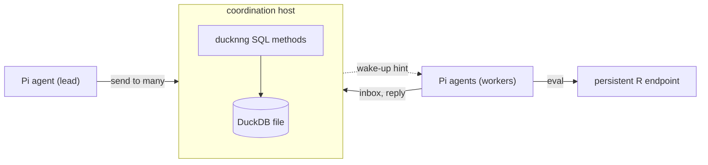

<!-- README.md is generated from README.qmd with `make readme`. Edit README.qmd. -->

```{r}
#| include: false
piknit::register_engines()
knitr::opts_chunk$set(comment = "")
state <- tempfile("pi-ducknng-readme-")
dir.create(state, mode = "0700")
Sys.setenv(STATE = state, PI_DUCKNNG_COORDINATION_PROJECT = "readme")
```

# pi-ducknng

<a href="https://lifecycle.r-lib.org/articles/stages.html#experimental"></a>
<a href="https://github.com/sounkou-bioinfo/pi-ducknng/actions/workflows/pkgdown.yaml"></a>

pi-ducknng gives [Pi](https://github.com/earendil-works/pi) agents two
services over [ducknng](https://github.com/RGenomicsETL/ducknng): a persistent
R session to compute in, and a durable mailbox that lets independently started
agents hand each other work, fan one question out to many of them, and gather
the answers.

The package is experimental and has no users outside itself. Its tools, SQL
schema and wire contract change without deprecation cycles or migrations, in
favour of a clearer model.

## Install

```sh
pi install git:github.com/sounkou-bioinfo/pi-ducknng
```

The first call builds the pinned ducknng source, which needs Git, Make, CMake,
Python and a C/C++ toolchain. The persistent R endpoint needs the packages
under `Imports` in [`DESCRIPTION`](DESCRIPTION).

## Persistent R

An agent starts the R endpoint, reads its manifest, and keeps working in the
same R process across calls:

```{pi, provider="openai-codex", model="gpt-6-astra", thinking="medium", timeout=900, no_extensions=TRUE, extension="./extensions/pi-ducknng/index.ts"}
Using the package tools, start the R adapter and follow its ducknng manifest. In one eval call, create and return `mpg_by_cyl <- aggregate(mpg ~ cyl, data = datasets::mtcars, FUN = mean)`. In a separate eval call, use the persisted `mpg_by_cyl` to return `transform(mpg_by_cyl, delta_from_4cyl = mpg - mpg[cyl == 4])`. Close the endpoint. Report the manifested methods and decoded rows, beginning with `AGENT_DUCKNNG_MANIFEST_CALL_OK` only when both calls used the same endpoint process and succeeded.
```

The R environment lives until `close` or until the Pi process that started it
exits. Results come back as Arrow IPC.

## Parallel research

The coordination endpoint is a DuckDB database whose methods are
[SQL files](coordination/methods) served by ducknng. Start it outside any Pi
session, in a private directory:

```{bash}
install -d -m 700 "$STATE"
node tools/pi-coordination-endpoint.ts \
  "$STATE/coordination.url" "$STATE/coordination.duckdb" > "$STATE/endpoint.log" 2>&1 &
echo $! > "$STATE/endpoint.pid"
until [ -s "$STATE/coordination.url" ]; do sleep 0.1; done
echo "coordination endpoint ready"
```

```{r}
#| include: false
Sys.setenv(
  PI_DUCKNNG_COORDINATION_URL = readLines(file.path(state, "coordination.url")),
  PI_DUCKNNG_AGENT_ID = "lead"
)
```

A Pi session joins when `PI_DUCKNNG_COORDINATION_URL`,
`PI_DUCKNNG_COORDINATION_PROJECT` and `PI_DUCKNNG_AGENT_ID` are set. It then
has `coordination_send`, `coordination_inbox`, `coordination_agents`,
`coordination_reserve` and `coordination_release`. A lead agent fans one
question out to three workers that have not started yet:

```{pi, provider="openai-codex", model="gpt-6-astra", thinking="medium", timeout=900, no_extensions=TRUE, extension="./extensions/pi-ducknng/index.ts"}
You are agent `lead`. Make one coordination_send call to recipients `w-cyl`, `w-gear`, and `w-am` with this content: `Which grouping of datasets::mtcars separates mean mpg the most? Your agent ID names your grouping. Reply in_reply_to this broadcast with the spread of your group means.` Report the broadcast ID and the recipients, beginning with `AGENT_FANOUT_SENT` only when the send was stored.
```

Each worker is its own `pi -p` process with this prompt:

```{bash}
cat tools/readme/worker-prompt.md
```

The three run at the same time. Each pulls its copy, computes in its own
persistent R session, and replies:

```{bash}
for worker in w-cyl w-gear w-am; do
  PI_DUCKNNG_AGENT_ID="$worker" timeout 900 pi --provider openai-codex \
    --model gpt-6-astra --thinking medium --no-extensions \
    -e ./extensions/pi-ducknng/index.ts --no-session \
    -p "$(cat tools/readme/worker-prompt.md)" > "$STATE/$worker.out" 2>&1 &
done
wait
grep -h -A1 '^AGENT_WORKER_REPLIED' "$STATE"/w-*.out
```

The endpoint, not the agents, confirms the fan-in. This check leases the
replies for one second without acknowledging them, so the lead still receives
them afterwards:

```{r}
source("tools/ducknng-rpc.R")
url <- Sys.getenv("PI_DUCKNNG_COORDINATION_URL")
peek <- rpc_call(url, "register", list(
  project_id = "readme", agent_id = "lead",
  instance_id = "verifier", operation_key = "verify"
))
replies <- rpc_call(url, "receive", list(
  registration_id = peek$registration_id, limit = 8, visibility_timeout_ms = 1000
))$messages
threads <- unique(vapply(replies, function(m) m$in_reply_to %||% "", ""))
stopifnot(length(replies) == 3L, length(threads) == 1L, nzchar(threads))
invisible(rpc_call(url, "unregister", list(registration_id = peek$registration_id)))
cat("COORDINATION_FANIN_VERIFIED",
  vapply(replies, function(m) paste0(m$sender_agent_id, ": ", m$content), ""),
  sep = "\n")
Sys.sleep(1.5)
```

The lead gathers the answers:

```{pi, provider="openai-codex", model="gpt-6-astra", thinking="medium", timeout=900, no_extensions=TRUE, extension="./extensions/pi-ducknng/index.ts"}
You are agent `lead`. Call coordination_inbox with wait_ms 20000 and limit 8 to gather the replies to your broadcast. List each worker's reply line, then name the grouping with the largest spread, beginning with `AGENT_FANIN_DONE` only when three replies arrived with the same in_reply_to.
```

```{bash}
#| include: false
kill "$(cat "$STATE/endpoint.pid")"
```

## How it fits together



- The coordination host is a Node process that loads ducknng into DuckDB and
  serves the SQL methods. It owns the database file; agents reach it only
  through those methods.
- `send` stores one copy per recipient before it replies, then publishes an
  opaque wake-up hint per mailbox. Subscribed agents receive at once, and
  polling repairs any hint that was lost.
- Pi owns the conversation. The adapter keeps the registration out of model
  context and frames every delivered message with its sender, so another
  agent's text never reads as the user's.

## Guarantees

- **At least once.** A crash between delivery and acknowledgement redelivers
  the same message ID. Work done in response is not exactly once.
- **Stored before acknowledged.** Mail survives disconnected sessions and
  endpoint restarts. Mail nobody receives becomes a dead letter after 7 days.
- **Leases guard Pi's file tools.** While another session holds a path, Pi's
  `edit` and `write` refuse to touch it. Writes made through `bash` are not
  guarded.
- **Hints are only hints.** A wake-up carries no mail, and correctness never
  depends on it arriving.

## Across hosts

Over `ipc://`, filesystem permissions decide who may connect. To serve agents
on other hosts, run the endpoint on mutual TLS with a grants file that says
which certificate may act as which agent. ducknng holds the TLS material in
memory, so it can come straight from the environment. A throwaway CA signs the
certificates here:

```{bash}
#| include: false
install -d -m 700 "$STATE/tls"
cd "$STATE/tls"
openssl req -x509 -newkey rsa:2048 -nodes -keyout ca.key -out ca.pem -days 1 \
  -subj /CN=readme-ca > /dev/null 2>&1
issue() {
  openssl req -newkey rsa:2048 -nodes -keyout "$1.key" -out "$1.csr" -subj "/CN=$2" \
    > /dev/null 2>&1
  printf '%b\n' "$3" > "$1.ext"
  openssl x509 -req -in "$1.csr" -CA ca.pem -CAkey ca.key -CAcreateserial \
    -out "$1.crt" -days 1 -extfile "$1.ext" > /dev/null 2>&1
}
issue server 127.0.0.1 'subjectAltName=IP:127.0.0.1\nextendedKeyUsage=serverAuth'
issue reviewer reviewer 'extendedKeyUsage=clientAuth'
issue intruder intruder 'extendedKeyUsage=clientAuth'
```

```{bash}
cat > "$STATE/grants.json" <<'JSON'
[{"peer_identity": "tls:cn:reviewer", "project_id": "readme", "agent_id": "reviewer"}]
JSON
PI_DUCKNNG_COORDINATION_TLS_CERT_PEM="$(cat "$STATE/tls/server.crt")" \
PI_DUCKNNG_COORDINATION_TLS_KEY_PEM="$(cat "$STATE/tls/server.key")" \
PI_DUCKNNG_COORDINATION_TLS_CA_PEM="$(cat "$STATE/tls/ca.pem")" \
PI_DUCKNNG_COORDINATION_GRANTS_FILE="$STATE/grants.json" \
PI_DUCKNNG_COORDINATION_EVENTS_URL="wss://127.0.0.1:0/events" \
  node tools/pi-coordination-endpoint.ts "$STATE/mtls.url" "$STATE/mtls.duckdb" \
  tls+tcp://127.0.0.1:0 > "$STATE/mtls.log" 2>&1 &
echo $! > "$STATE/mtls.pid"
until [ -s "$STATE/mtls.url" ]; do sleep 0.1; done
```

Pi sessions pass their certificate the same way, through
`PI_DUCKNNG_TLS_CA_PEM`, `PI_DUCKNNG_TLS_CERT_PEM` and
`PI_DUCKNNG_TLS_KEY_PEM`, or through the matching `*_FILE` variables.
`tools/coordination-call.ts` reads the same variables:

```{bash}
register_as() {
  PI_DUCKNNG_TLS_CA_PEM="$(cat "$STATE/tls/ca.pem")" \
  PI_DUCKNNG_TLS_CERT_PEM="$(cat "$STATE/tls/$1.crt")" \
  PI_DUCKNNG_TLS_KEY_PEM="$(cat "$STATE/tls/$1.key")" \
    node tools/coordination-call.ts "$(cat "$STATE/mtls.url")" register \
    '{"project_id": "readme", "agent_id": "reviewer", "instance_id": "'"$1"'",
      "operation_key": "demo"}' agent_id,events.url 2>&1
}
register_as reviewer
register_as intruder || true
```

```{bash}
#| include: false
kill "$(cat "$STATE/mtls.pid")"
```

The granted certificate registers and learns its `wss://` hint listener. The
other is refused before any state changes. A registration ID is also useless
to any certificate but the one that created it.

## Embedding

A host process that owns a `pi-agent-core` `AgentHarness` can attach a lane to
a mailbox with `attachCoordinationLane` from
[`extensions/pi-ducknng/harness.ts`](extensions/pi-ducknng/harness.ts). Each
message is committed to the lane before it is acknowledged, and a redelivered
message is matched to its existing lane entry by message ID.
[`test/coordination-harness.test.js`](test/coordination-harness.test.js) runs
it against a real harness.

## Guides

Every guide is executed. Its outputs, including what the live agents said,
are recorded when the guide is built.

**Persistent R**

- [An agent calls persistent R](https://sounkou-bioinfo.github.io/pi-ducknng/articles/agent-product-path.html):
  state that survives across calls.
- [An active binding in a selected environment](https://sounkou-bioinfo.github.io/pi-ducknng/articles/agent-active-binding.html):
  the `envir` and `enclos` controls.

**Coordination**

- [Hand work between agents through a durable mailbox](https://sounkou-bioinfo.github.io/pi-ducknng/articles/coordination-mailbox.html):
  offline mail, idempotent sends, leases, acknowledgement, and the envelope
  an agent sees.
- [Fan a question out and gather the answers](https://sounkou-bioinfo.github.io/pi-ducknng/articles/coordination-fanout.html):
  recipient lists, a live broadcast to two workers, and replies threaded by
  `in_reply_to`.
- [Keep agents off each other's files with reservations](https://sounkou-bioinfo.github.io/pi-ducknng/articles/coordination-reservations.html):
  a live agent refused by the edit gate, path-tree conflicts, renewal, and
  fencing values.
- [Recover from crashes and restarts](https://sounkou-bioinfo.github.io/pi-ducknng/articles/coordination-durability.html):
  an endpoint killed mid-lease, redelivery after restart, and dead letters.

**Deployment**

- [Serve agents across hosts with mutual TLS](https://sounkou-bioinfo.github.io/pi-ducknng/articles/coordination-mtls.html):
  in-memory PEM, grants, refused impersonation, and hints over `wss://`.
- [Embed coordination in an AgentHarness host](https://sounkou-bioinfo.github.io/pi-ducknng/articles/coordination-harness.html):
  a mailbox delivered into a harness lane, with one lane entry per message
  even when an acknowledgement is lost.

[`THESIS.md`](THESIS.md) lists the contracts, owners and invariants, and the
tests that prove them.

## Pinned runtime

```{r}
#| echo: false
pins <- read.table(
  "DEPENDENCIES", sep = "=", quote = "", comment.char = "",
  col.names = c("key", "value")
)
pin <- function(key) pins$value[pins$key == key]
knitr::kable(data.frame(
  Component = c(
    "DuckDB", "`@duckdb/node-api`", "ducknng",
    "`@earendil-works/pi-coding-agent`", "`@earendil-works/pi-agent-core`"
  ),
  Version = c(
    pin("DUCKDB_VERSION"), pin("DUCKDB_NODE_API_VERSION"),
    sprintf("`%s`", pin("DUCKNNG_REF")),
    pin("PI_CODING_AGENT_VERSION"), pin("PI_AGENT_CORE_VERSION")
  )
))
```

[`DEPENDENCIES`](DEPENDENCIES) is the version authority and records the exact
source commits.
