```{r}
#| include: false
piknit::register_engines()
```

# pi-ducknng

`pi-ducknng` is a ducknng-backed network substrate for Pi, beginning with persistent R sessions.

## Architecture



The committed SVG is generated from the Mermaid source in
`man/figures/architecture.mmd`.

DuckDB owns native extension loading and host-language calls. The hard-vendored ducknng release owns transport, mbedTLS, identity, framing, manifests, sessions, AIO, cancellation, and codecs. The R package composes `nanonext` and `mirai`; it does not reproduce those layers.

## Pi package

Install the repository as a Pi package:

```sh
pi install git:github.com/sounkou-bioinfo/pi-ducknng
```

The package contributes three model tools: `persistent_r_start` places the first adapter, `ducknng_describe` reads any compatible endpoint manifest, and `ducknng_call` invokes a declared method. On first use it builds the pinned ducknng source; this requires Git, Make, CMake, Python, and a C/C++ toolchain.

## Pi-to-R proof

The evaluated cell below loads the package extension into an OpenAI Codex agent.
The model discovers the endpoint's methods and request examples, then performs
an `mtcars` analysis whose intermediate table survives across fresh DuckDB
clients.

```{pi, provider="openai-codex", model="gpt-5.4", thinking="medium", timeout=900, extension="./extensions/pi-ducknng/index.ts"}
Using the package tools, start the R adapter and follow its ducknng manifest. In one eval call, create and return `mpg_by_cyl <- aggregate(mpg ~ cyl, data = datasets::mtcars, FUN = mean)`. In a separate eval call, use the persisted `mpg_by_cyl` to return `transform(mpg_by_cyl, delta_from_4cyl = mpg - mpg[cyl == 4])`. Close the endpoint. Report the manifested methods and decoded rows, beginning with `AGENT_DUCKNNG_MANIFEST_CALL_OK` only when both calls used the same endpoint process and succeeded.
```


`persistent_r_start` returns an NNG URL, `ducknng_describe` fetches the endpoint's ducknng RPC manifest, and `ducknng_call` sends declared calls as ducknng frames. Each tool request opens and closes a fresh DuckDB instance. Eval results are Arrow IPC streams produced by nanoarrow and decoded by ducknng; the mirai-owned R environment remains in the same endpoint process.

Executable documentation uses `piknit`; `make readme` rejects output without the agent's success receipt.

## Agent-backed pkgdown articles

Two pkgdown articles are authored as `vignettes/*.Rmd.orig` and precomputed with
`openai-codex`/`gpt-5.4` agents. The committed `.Rmd` results let package and
site builds remain credential-free, following the
[rOpenSci precomputed-vignette pattern](https://ropensci.org/blog/2019/12/08/precompute-vignettes/).

``` sh
make vignettes
make site
```

## Pinned runtime tuple

| Component | Version |
|---|---|
| DuckDB | 1.5.4 |
| `@duckdb/node-api` | 1.5.4-r.1 |
| ducknng | `v0.1.1-duckdb1.5.4` |

[`DEPENDENCIES`](DEPENDENCIES) records the exact source commit.
